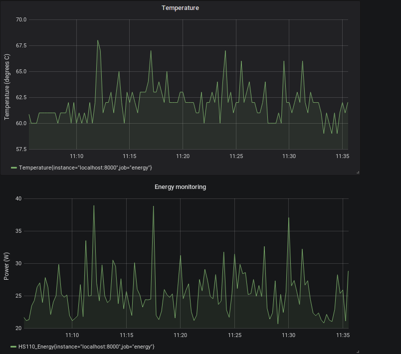

scripts for forwarding energy and energy data
=========================

## 1. Functionality

Python scripts collects information about energy and temperature to a Prometheus client, which is forwarded to a prometheus server and Grafana for visualisation and monitoring. The exampe is based on the TPLink HS110 smartplug. This alows for a cost-effective measurement of power usage and temperature monitoring for computers.

The script is based on trying a similar monitoring application based on an INA219 monitoring interface in combination with a Raspberry Pi.

## 2. Installation

### 2.1 Libraries
The following python libraries need to be installed:

* python 2.7: the scripts are based on python 2.7
* lm-sensors: a package to allow use of computer sensors

<pre>

$ sudo apt-get install lm-sensors

# Run the mkdev.sh script in the lm-sensors source.

</pre>

<pre>
$ sensors-detect
# answer questions 
$ sensors
acpitz-virtual-0
Adapter: Virtual device
temp1:        +54.0°C  (crit = +103.0°C)

coretemp-isa-0000
Adapter: ISA adapter
Physical id 0:  +55.0°C  (high = +84.0°C, crit = +100.0°C)
Core 0:         +54.0°C  (high = +84.0°C, crit = +100.0°C)
Core 1:         +53.0°C  (high = +84.0°C, crit = +100.0°C)
Core 2:         +54.0°C  (high = +84.0°C, crit = +100.0°C)
Core 3:         +52.0°C  (high = +84.0°C, crit = +100.0°C)

asus-isa-0000
Adapter: ISA adapter
cpu_fan:     1800 RPM
temp1:        +54.0°C  
</pre>

### 2.2 Networking
 
Configure the HS110 client wireless interface. In Ubunto this can be done using Hidden Wi-Fi network and adding a hotspot. Using netdiscover the network address can be identified. 

Depending on the Linux networking configuration the MAC address should be coupled with a fixed ip-adresss. Using the NetworkManager under ubuntu addresses will be generated. The configuration taking into account mac-addresses for the smartplug is ill-defined and requires experimenting.
   
### 2.3 Prometheus

Prometheus can be installed in Ubuntu ia the following command:
   <pre>
  sudo apt-get install prometheus
  </pre>
 To ensure that the daemons are started at boot the following is required:
   <pre>
  sudo systemctl enable prometheus
  
  sudo service prometheus restart
  </pre>
 
 The prometheus.yml needs to be updated to include the data provided by the *metric.py* script.
  <pre>
  scrape_configs:
   - job_name: 'laptop'
    static_configs:
      - targets: ['localhost:9100']
  - job_name: 'energy'
    static_configs:
      - targets: ['localhost:8000']
  
  </pre>
  
  
### 2.4 Grafana
 
 Grafana can be installed via:
 <pre>
  sudo apt install grafana
  </pre>
 The startup daemon needs to be started at boot.
  
<pre>
  sudo systemctl enable prometheus
  sudo service prometheus restart
  </pre>

##3. Operations

Using metric.py the server is started which makes the power and temperature available.

<pre>

./metric.py -h
usage: metric.py [-h] -t <hostname> (-c <command> | -j <JSON string>)

TP-Link Wi-Fi Smart Plug Client v0.2

optional arguments:
  -h, --help            show this help message and exit
  -t <hostname>, --target <hostname>
                        Target hostname or IP address
  -c <command>, --command <command>
                        Preset command to send. Choices are: reset, schedule,
                        antitheft, wlanscan, info, on, off, reboot, countdown,
                        time, cloudinfo, energy
  -j <JSON string>, --json <JSON string>
                        Full JSON string of command to send

</pre>

 In Grafana the datasources should include prometheus data. 
The file metric_INA219.py has been developed for the Raspberry Pi monitoring.

 woensdag, 25. juli 2018 12:33 

